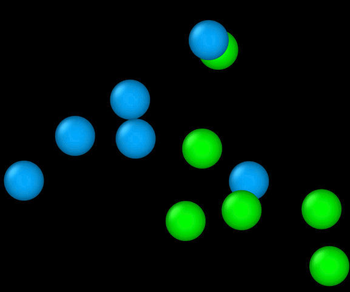

# Basin-Hopping Global Optimizer (C++)

[](https://doi.org/10.1038/s41467-022-35690-8)
[](https://isocpp.org/)
[](LICENSE)

A custom C++ implementation of a tailored Basin-Hopping Monte Carlo (BHMC) algorithm for global energy minimization — published in *Nature Communications* (2022). Designed from scratch to solve a class of global optimization problems over complex, high-dimensional energy landscapes.



*Optimizer converging from a random initial configuration to the globally stable square-ordered bilayer superlattice. Blue and green spheres represent two species of nanoparticles (NPs) trapped at a fluid-fluid interface. Each frame represents a newly discovered global energy minimum.*

---

## Robotics Relevance

The core problem this optimizer solves — escaping local minima to find the global minimum of a complex energy landscape — maps directly to fundamental challenges in robotics planning and control:

| This Work | Robotics Equivalent |
|---|---|
| Energy landscape over NP configurations | Cost landscape over robot states / trajectories |
| Basin-hopping escape moves | Local minima avoidance in motion planning |
| Conjugate gradient local minimization | Trajectory optimization (iLQR, DDP) |
| Metropolis acceptance criterion | Simulated annealing in sampling-based planners |
| Ultrafast shape recognition (USR) | Loop closure / duplicate state detection |
| Restart from global best every N steps | Replanning from best-known solution |

The ability to reliably escape local minima and find globally optimal configurations is critical in both physical simulation and robot motion planning — this implementation demonstrates that capability at publication quality.

---

## Algorithm Overview

Standard BHMC transforms the complex energy surface into a staircase topography via local minimization, then explores it via Monte Carlo sampling. This implementation extends the standard algorithm with six custom MC moves specifically designed for quasi-2D interfacial structures and a duplicate-detection mechanism to prevent stagnation.

```
Random seed configuration
        ↓
Apply MC move → perturbed configuration
        ↓
Conjugate gradient local minimization
(Polak-Ribière variant, Wolfe line search conditions)
        ↓
Metropolis criterion: accept or reject new configuration
        ↓
Ultrafast shape recognition (USR): detect duplicate structures
→ if duplicate detected, advance to next move type
        ↓
Every 2000 steps: reset to current global best structure
        ↓
Repeat until convergence
```

---

## Six Custom MC Moves

Standard BHMC displacement moves are designed for 3D bulk systems and are inefficient for the quasi-2D interfacial geometries explored here. Six new moves were designed to improve sampling efficiency:

| Move | Description |
|---|---|
| **Displacement (D)** | Standard random displacement around current position; fixed max displacement for all NPs |
| **Position-based Displacement (P)** | Displacement magnitude scaled by distance from cluster centroid — exploits energy landscape differences between surface and core NPs |
| **Twist (T)** | Separates NPs into above/below interface groups; randomly rotates one group about the interface normal through the cluster centroid |
| **Interfacial (I)** | Directly displaces the NP farthest from the interface toward it — addresses the slow diffusive timescale for NPs to reach the interface |
| **Switch (S)** | Targets pairs of opposite-species NPs that have intruded into their disfavored fluid layer and swaps their species identity |
| **NNeighbor (R)** | Rotates the least-coordinated NP (or farthest from centroid) on a circle parallel to the interface — designed for filling vacant sites in planar structures |

**Move sequence:** `P → S → T → D → I → S → R → D → R`

Each move executes until consecutively rejected by the Metropolis criterion, then advances to the next move in the sequence. If the optimizer stagnates in the same structure for more than 5 consecutive acceptances (detected via USR), the sequence also advances.

---

## Key Implementation Details

- Written from scratch in **C++11** — no external dependencies beyond the standard library
- **Polak-Ribière conjugate gradient** with inexact Wolfe line search for efficient local minimization
- **Ultrafast shape recognition (USR)** algorithm for duplicate structure detection — prevents the optimizer from cycling repeatedly through the same local minimum
- **Periodic restart** from global best every 2000 MC steps — prevents drift from the best-found solution in long runs
- **Periodic boundary conditions** in x and y; fixed boundaries in z — appropriate for quasi-2D interfacial assembly
- Output in **xyz format** — directly readable by OVITO for 3D visualization and trajectory analysis
- Validated against known Lennard-Jones cluster ground states (11, 31, 50 atoms) and against coarse-grained MD simulation results

---

## Physics Model

The system consists of two species of surface-functionalized spherical NPs trapped at a planar fluid-fluid interface. The total energy combines:

**Interparticle interactions** — shifted Lennard-Jones pairwise potential with interaction strengths proportional to NP radii (consistent with van der Waals size scaling):

```
U_ij(r) = 4ε_ij [ (σ/(r-Δ_ij))^12 - (σ/(r-Δ_ij))^6 ]
```

**Interfacial free energy** — analytical model accounting for surface tension (trapping NPs at the interface) and surface energy difference (expelling NPs toward their preferred fluid layer):

```
ΔF_i(z_m) = -πR_i²γ[1 - (Δγ_i/γ)²]
```

Four dimensionless parameters fully describe the assembly thermodynamics:
- **φ** — NP size ratio (R2/R1)
- **ε** — interparticle interaction strength relative to surface tension
- **χ** — surface energy difference ratio (controls NP displacement from interface)
- **ω** — ratio of surface energy differences between the two NP species

---

## System Parameters (Input File)

```
6          ← Number of type I NPs
6          ← Number of type II NPs
3          ← Radius of NP I (R1)
3          ← Radius of NP II (R2)
1          ← Omega (ω)
1          ← Eff (effective radius factor, set to 1.0)
0.8        ← Chi (χ)
0.04       ← Epsilon (ε)
```

The included `Input` file runs a 6:6 binary NP system at φ=1, χ=0.8, ε=0.04, which converges to a **hexagonally ordered bilayer** — one of the novel 2D superlattice structures discovered and experimentally validated in the paper.

---

## How to Build & Run

**Requirements:** g++ with C++11 support (standard on Linux/macOS)

```bash
# Clone the repo
git clone https://github.com/yilong-sim/basin-hopping-global-optimizer.git
cd basin-hopping-global-optimizer

# Build
make

# Run with the included example
./BHMC Input
```

**Runtime:** approximately 25 MC steps/second for a 12-particle system.
Typical convergence ranges from 1 minute to 100 hours depending on system size and parameter complexity.

To change box dimensions for larger systems, edit `BHMC.h` line 53:
- `HEIGHT` — box dimension in z
- `DENS` — box dimension in x and y

---

## Output Files

| File | Contents |
|---|---|
| `GM_ENERGIES.dat` | Energy at each newly discovered global minimum — last entry is the best result |
| `GM_MOVIE.xyz` | NP configurations at each new global minimum — clean convergence trajectory |
| `LM_ENERGIES.dat` | Energies of all accepted local minima |
| `LM_MOVIE.xyz` | NP configurations for all accepted local minima — full optimization trajectory |

Visualize trajectory files with [OVITO](https://www.ovito.org/) (free, open-source).

---

## Results

The optimizer was used to systematically explore the assembly phase diagram of binary NP systems across 5 size ratios (φ = 1/3, 1/2, 2/3, 5/6, 1) and a wide range of χ and ε values. Key discoveries:

- **Monolayer superlattices**: AB-, AB2-, and AB3-type arrangements including Kagome, honeycomb, square, and rhombic ordering
- **Bilayer superlattices**: AB-, AB2-, A3B5-, and A4B6-type structures including the first prediction of a periodic pentagonal tessellation at a fluid interface
- **Phase boundaries**: Analytical model capturing monolayer–bilayer–globular phase transitions
- Multiple predicted structures subsequently **validated against experiment**

The A3B5- and A4B6-type bilayer superlattices predicted by this optimizer had never previously been reported in the literature.

---

## Citation

If you use this code, please cite:

```bibtex
@article{zhou2022discovery,
  title={Discovery of two-dimensional binary nanoparticle superlattices 
         using global Monte Carlo optimization},
  author={Zhou, Yilong and Arya, Gaurav},
  journal={Nature Communications},
  volume={13},
  pages={7976},
  year={2022},
  doi={10.1038/s41467-022-35690-8}
}
```

---

## Author

**Yilong Zhou**
Postdoctoral Scholar, Lawrence Berkeley National Laboratory

[Portfolio](https://yilong-sim.github.io) · [Google Scholar](https://scholar.google.com/citations?hl=en&user=eORIck8AAAAJ) · [GitHub](https://github.com/yilong-sim) · [LinkedIn](https://linkedin.com/in/yilong-zhou)
